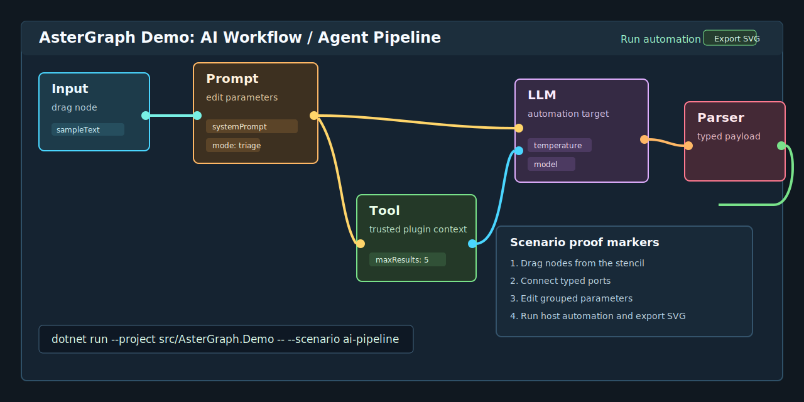

# AsterGraph

<p align="right">
  <a href="./README.md"></a>
  
</p>

AsterGraph 是一个面向 .NET 的模块化节点图编辑器工具包，提供可复用的编辑器运行时、面向自定义 UI 或原生壳层的 canonical session/runtime 路线、默认 Avalonia hosted-UI 路径，以及面向宿主的插件、自动化、本地化、诊断和呈现扩展边界。



启动预置 AI workflow 场景：

```powershell
dotnet run --project src/AsterGraph.Demo -- --scenario ai-pipeline
```

这个场景把 SDK 展示成一个可嵌入的 authoring surface：拖动 definition-backed 节点、连接 typed ports、编辑分组参数、查看可信插件上下文、运行宿主自动化，然后通过宿主同样会使用的 session/runtime API 保存或导出图。

## 评估路径

| 时间 | 做什么 | 得到什么 |
| --- | --- | --- |
| 30 秒 | 先看上面的 AI workflow 场景；需要视觉导览时运行 `src/AsterGraph.Demo -- --scenario ai-pipeline`。 | 不读维护者 proof 也能判断这是哪类 graph editor SDK。 |
| 5 分钟 | 生成 `dotnet new astergraph-avalonia`，运行 starter，再用 `ConsumerSample.Avalonia -- --proof --support-bundle <path>` 验证。 | 得到一条可复制的 hosted 路线，包含宿主动作、选中节点参数、可信插件证据和本地 support bundle。 |
| 30 分钟 | 阅读 [Quick Start](./docs/zh-CN/quick-start.md)、[Consumer Sample](./tools/AsterGraph.ConsumerSample.Avalonia/README.md) 和 [Host Integration](./docs/zh-CN/host-integration.md)。 | 能在 hosted UI、runtime-only、plugin 和 migration 路线之间做选择，而且不改变 runtime model。 |

维护者和高级 proof 细节放在 [Public Launch Checklist](./docs/zh-CN/public-launch-checklist.md)、[Adapter Capability Matrix](./docs/zh-CN/adapter-capability-matrix.md) 和 [Beta Support Bundle](./docs/zh-CN/support-bundle.md)。

生成原生 Avalonia 宿主或插件 starter：

```powershell
dotnet new install ./templates
dotnet new astergraph-avalonia -n MyGraphHost
dotnet new astergraph-plugin -n MyGraphPlugin --PluginId my.graph.plugin
dotnet run --project tools/AsterGraph.PluginTool -- validate ./MyGraphPlugin/bin/Debug/net8.0/MyGraphPlugin.dll
```

## 从哪里开始

| 我现在要做什么 | 先看哪里 | 为什么 |
| --- | --- | --- |
| 想先看第一个 hosted 入口 | [`tools/AsterGraph.Starter.Avalonia`](./tools/AsterGraph.Starter.Avalonia/) | 最小端到端 Avalonia 脚手架；cookbook 里的第一个 hosted 跳板 |
| 想生成原生 hosted app | [`templates/astergraph-avalonia`](./templates/astergraph-avalonia/) | 面向跨平台 Avalonia 宿主的 `dotnet new` 脚手架 |
| 想生成插件 starter | [`templates/astergraph-plugin`](./templates/astergraph-plugin/) | 面向可信 in-process 插件的 `dotnet new` 脚手架 |
| 想最快跑起仅运行时路径 | [`tools/AsterGraph.HelloWorld`](./tools/AsterGraph.HelloWorld/) | 最小仅运行时样例；面向自定义 UI 或原生壳层的 canonical 路线 |
| 想嵌入默认 Avalonia UI | [`tools/AsterGraph.HelloWorld.Avalonia`](./tools/AsterGraph.HelloWorld.Avalonia/) | 在 starter 之后的最小默认 UI 样例 |
| 想先看一个更真实的宿主集成 | [Consumer Sample](./tools/AsterGraph.ConsumerSample.Avalonia/README.md) | 同一条 canonical 路线上的中等复杂度样例，包含宿主动作、参数编辑和一个可信插件 |
| 想接到现有宿主里 | [Host Integration](./docs/zh-CN/host-integration.md) | 路线矩阵、包边界和迁移说明 |
| 想先把完整能力看一遍 | [Demo Guide](./docs/zh-CN/demo-guide.md) | 展示插件、自动化、本地化和独立表面 |
| 想验证打包消费或维护发布 | [CONTRIBUTING.md](./CONTRIBUTING.md) 和 [Public Launch Checklist](./docs/zh-CN/public-launch-checklist.md) | proof lanes、CI 和 release 流程 |

这条 hosted route ladder 是 `Starter.Avalonia -> HelloWorld.Avalonia -> ConsumerSample.Avalonia`。
五分钟 hosted 复制路径：先跑 starter 脚手架，再用 `ConsumerSample.Avalonia -- --proof --support-bundle <path>` 验证，最后再看完整 Demo。
最短 hosted 组合代码可以用 `AsterGraphHostBuilder.Create().UseDocument(document).UseCatalog(catalog).UseDefaultCompatibility().BuildAvaloniaView()`；当你需要显式接入每个服务时，再降到 `AsterGraphEditorFactory.Create(...)` 和 `AsterGraphAvaloniaViewFactory.Create(...)`。

## 公开 Beta

- 当前可安装包版本：`0.11.0-beta`
- 与当前包版本配对的对外 SemVer prerelease 标签：`v0.11.0-beta`
- 历史仓库里程碑标签系列：`v1.x` 风格的公开前检查点（公开前的旧检查点，不是 NuGet 包版本）
- GitHub prerelease/Release 条目必须使用与 NuGet 包相同的 SemVer；本地规划里程碑不是公开发布标识
- 公开发布包目标框架：`net8.0`、`net9.0`
- release lane 还会用打包后的 `HostSample` 额外证明下游 `.NET 10` 消费兼容性
- 后续对外 prerelease tag 应与当前包版本的 SemVer 对齐，比如 `v0.11.0-beta`
- 包版本与历史仓库 tag 的关系说明：[Versioning](./docs/zh-CN/versioning.md)
- 冻结的支持边界和面向 `v1.0.0` 的升级指引：[稳定化支持矩阵](./docs/zh-CN/stabilization-support-matrix.md)
- 从第一次安装到真实宿主 proof 的评估阶梯：[公开 Beta 评估路径](./docs/zh-CN/evaluation-path.md)
- 当前范围、非目标和已知限制：[Alpha Status](./docs/zh-CN/alpha-status.md)

## 从 NuGet 安装

大多数新宿主从下面几条命令起步：

```powershell
# 使用默认 Avalonia UI
dotnet add package AsterGraph.Avalonia --prerelease

# 只要 runtime / 自定义 UI
dotnet add package AsterGraph.Editor --prerelease

# 需要节点定义、标识符、provider 契约
dotnet add package AsterGraph.Abstractions --prerelease
```

只有当宿主还需要直接操作 `GraphDocument`、序列化或兼容性 API 时，再额外引用 `AsterGraph.Core`。

## 选择接入路线

| 路线 | 适合什么场景 | 第一个 API | 第一个样例 |
| --- | --- | --- | --- |
| Hosted starter scaffold | 宿主先要一个最小端到端的 Avalonia 入口，再往完整应用扩展 | `AsterGraphEditorFactory.Create(...)` + `AsterGraphAvaloniaViewFactory.Create(...)` | [`AsterGraph.Starter.Avalonia`](./tools/AsterGraph.Starter.Avalonia/) |
| thin hosted builder | 宿主要走常见 Avalonia 路线，但希望少写组合样板 | `AsterGraphHostBuilder.Create(...).BuildAvaloniaView()` | [`AsterGraph.Starter.Avalonia`](./tools/AsterGraph.Starter.Avalonia/) |
| 仅运行时 / 自定义 UI | 宿主自己管 UI，只想拿推荐的运行时边界 | `AsterGraphEditorFactory.CreateSession(...)` + `IGraphEditorSession` | [`AsterGraph.HelloWorld`](./tools/AsterGraph.HelloWorld/) |
| 默认 Avalonia UI | 宿主想直接复用默认编辑器壳层或独立 Avalonia 表面 | `AsterGraphEditorFactory.Create(...)` + `AsterGraphAvaloniaViewFactory.Create(...)` | [`AsterGraph.HelloWorld.Avalonia`](./tools/AsterGraph.HelloWorld.Avalonia/) |
| retained 迁移 | 现有宿主要分批迁移，暂时还离不开旧的 MVVM 入口 | `new GraphEditorViewModel(...)` + `new GraphEditorView { Editor = editor }` | [Host Integration](./docs/zh-CN/host-integration.md) |

新的运行时能力接入优先锚定第一条。Avalonia 路线是当前受支持的 hosted adapter 路线，retained 路线只作为迁移桥接。当前公开 beta 已经锁定 `WPF` 作为 adapter 2，后续 Avalonia/WPF 差异会通过 [Adapter Capability Matrix](./docs/zh-CN/adapter-capability-matrix.md) 里的 `supported / partial / fallback` 合同公开，而不是引入 adapter 专属 runtime API；WPF 当前仍是验证中的 adapter 2，不要把它写成与 Avalonia 已经对齐。

## 公开入口分工

- [`tools/AsterGraph.Starter.Avalonia`](./tools/AsterGraph.Starter.Avalonia/) = 第一个 hosted 脚手架；最小端到端 Avalonia 入口
- [`tools/AsterGraph.HelloWorld`](./tools/AsterGraph.HelloWorld/) = 仅运行时第一跑样例
- [`tools/AsterGraph.HelloWorld.Avalonia`](./tools/AsterGraph.HelloWorld.Avalonia/) = 在 starter 之后的最小默认 UI 样例
- [`tools/AsterGraph.ConsumerSample.Avalonia`](./tools/AsterGraph.ConsumerSample.Avalonia/README.md) = 介于 `HelloWorld.Avalonia` 和 `Demo` 之间的真实 hosted-UI consumer 样例
- [`tools/AsterGraph.HostSample`](./tools/AsterGraph.HostSample/) = 仅运行时 / 默认 UI 两条推荐路线的 proof harness，不是最先上手的入口
- [`tools/AsterGraph.PackageSmoke`](./tools/AsterGraph.PackageSmoke/) = 打包消费验证
- [`tools/AsterGraph.ScaleSmoke`](./tools/AsterGraph.ScaleSmoke/) = defended baseline/large proof、保守 defended 的 5000 节点 stress raster export proof，以及 history/state 验证
- [`tools/AsterGraph.PluginTool`](./tools/AsterGraph.PluginTool/) = 用于插件验证、trust evidence 和 hash inspection 的跨平台 CLI
- [`templates/astergraph-avalonia`](./templates/astergraph-avalonia/) = `dotnet new astergraph-avalonia` 原生 Avalonia starter
- [`templates/astergraph-plugin`](./templates/astergraph-plugin/) = `dotnet new astergraph-plugin` 可信插件 starter
- [`src/AsterGraph.Demo`](./src/AsterGraph.Demo/) = 展示宿主；菜单标签会跟着当前 UI 语言切换

## Official Capability Modules

下面这些 `Official Capability Modules` 就是当前公开的能力模块边界。它们都建立在 canonical session/runtime 路线上，默认 Avalonia UI 只是复用这些 seam 做组合，而不是再定义第二套能力模型。

| Module | Canonical seam | 第一个 proof / sample 锚点 |
| --- | --- | --- |
| `Selection` | `IGraphEditorSession.Commands.SetSelection(...)` + `Queries.GetSelectionSnapshot()` | `tools/AsterGraph.ScaleSmoke`、`tools/AsterGraph.HelloWorld` |
| `History` | `IGraphEditorSession.Commands.Undo()` / `Redo()` 以及 save/dirty 契约 | `tools/AsterGraph.ScaleSmoke`、[State Contracts](./docs/zh-CN/state-contracts.md) |
| `Clipboard` | 通过宿主 clipboard service 执行 `TryCopySelectionAsync()` / `TryPasteSelectionAsync()` | `tools/AsterGraph.HostSample` |
| `Shortcut Policy` | hosted Avalonia 路线上的 `AsterGraphCommandShortcutPolicy` | `tools/AsterGraph.PackageSmoke`、`tools/AsterGraph.HelloWorld.Avalonia` |
| `Layout` | session-backed 的 align/distribute commands | `src/AsterGraph.Demo` |
| `MiniMap` | 把 session snapshots 投影到 `AsterGraphMiniMapViewFactory.Create(...)` | `src/AsterGraph.Demo` |
| `Stencil` | session stencil queries 加 shipped Avalonia 插入表面 | `src/AsterGraph.Demo` |
| `Fragment Library` | 由 fragment workspace/library service 支撑的 session fragment/template commands | `src/AsterGraph.Demo` |
| `Export` | `IGraphSceneSvgExportService` + `TryExportSceneAsSvg()` | `tools/AsterGraph.HostSample` |
| `Baseline Edge Authoring` | `StartConnection(...)`、`CompleteConnection(...)`、reconnect/disconnect commands 和 pending-connection snapshot | `tools/AsterGraph.HostSample`、`tools/AsterGraph.ScaleSmoke` |
| `Node Surface Authoring` | `GetNodeSurfaceSnapshots()`、`TrySetNodeSize(...)` 以及走共享 session command 路径的参数编辑 | `src/AsterGraph.Demo`、[Advanced Editing Guide](./docs/zh-CN/advanced-editing.md) |
| `Hierarchy Semantics` | `GetHierarchyStateSnapshot()`、`GetNodeGroups()`、`GetNodeGroupSnapshots()` 以及 group collapse/move/resize/membership commands | `src/AsterGraph.Demo`、[Advanced Editing Guide](./docs/zh-CN/advanced-editing.md) |
| `Composite Scope Authoring` | wrap/promote/expose/unexpose/scope-navigation commands 加 scope/composite queries | `src/AsterGraph.Demo`、[Advanced Editing Guide](./docs/zh-CN/advanced-editing.md) |
| `Edge Semantics` | canonical session 路线上的连线注释、reconnect 和 disconnect commands | `src/AsterGraph.Demo`、[Advanced Editing Guide](./docs/zh-CN/advanced-editing.md) |
| `Edge Geometry Tooling` | `GetConnectionGeometrySnapshots()` 加 route-vertex insert/move/remove commands | `src/AsterGraph.Demo`、[Advanced Editing Guide](./docs/zh-CN/advanced-editing.md) |

## 支持的包边界

公开支持的 SDK 只有这四个包：

| 包 | 什么时候直接引用 | 说明 |
| --- | --- | --- |
| `AsterGraph.Abstractions` | 定义节点、标识符、catalog、样式 token、provider 契约 | 稳定契约层，无 UI 依赖 |
| `AsterGraph.Core` | 直接处理 `GraphDocument`、序列化或兼容性服务 | 模型与持久化层 |
| `AsterGraph.Editor` | 构建或扩展编辑器运行时 / session | 推荐的宿主运行时包 |
| `AsterGraph.Avalonia` | 嵌入默认 Avalonia UI | 默认 UI 入口包 |

`AsterGraph.Demo` 只是 sample，不属于公开支持的 SDK 边界。

## 当前 Beta 范围

当前已提供：

- 节点拖拽、选择、框选、多选编辑
- 缩放、平移、缩略图、待完成连线预览
- 保存 / 加载、撤销 / 重做、复制 / 粘贴、片段导入导出，以及 SVG 场景导出
- 对齐、分布、兼容多选下的共享参数编辑
- definition-driven inspector 元数据，支持参数分组、内建 list/text/number/bool/enum editor 和校验反馈
- 分层节点表面、固定组框、hierarchy snapshot、scoped composite、连线注释和 routed edge geometry 编辑
- 编译期节点定义注册与运行时插件注册
- 宿主控制的插件信任策略、本地候选发现和加载状态检查
- `IGraphEditorSession.Automation`
- 运行时诊断、检查快照与可替换宿主服务

当前明确不做：

- 算法执行引擎
- 超出 shipped definition-driven inspector 之外的任意 host-agnostic property editor framework
- 插件 marketplace 或远程安装 / 更新流程
- 插件卸载生命周期
- 进程级沙箱或不受信任代码隔离保证
- 专用脚本语言或 automation 可视化编排器

## 插件信任边界

插件加载当前是进程内执行。AsterGraph 现在提供的是：

- 通过 `PluginTrustPolicy` 做宿主级 allow/block
- 激活前做本地候选发现
- 运行时检查 trusted / loaded / blocked 的结果

它**不**提供沙箱或不受信任代码隔离。对公开 prerelease 宿主，建议配固定插件目录、显式 allowlist，以及你自己的签名或哈希校验策略。

## 文档入口

面向使用者的核心文档：

- [Versioning](./docs/zh-CN/versioning.md)
- [稳定化支持矩阵](./docs/zh-CN/stabilization-support-matrix.md)
- [Quick Start](./docs/zh-CN/quick-start.md)
- [Consumer Sample](./docs/zh-CN/consumer-sample.md)
- [Host Integration](./docs/zh-CN/host-integration.md)
- [Adapter Capability Matrix](./docs/zh-CN/adapter-capability-matrix.md)
- [Advanced Editing Guide](./docs/zh-CN/advanced-editing.md)
- [ScaleSmoke 基线](./docs/zh-CN/scale-baseline.md)
- [Authoring Inspector Recipe](./docs/zh-CN/authoring-inspector-recipe.md)
- [Adoption Feedback Loop](./docs/zh-CN/adoption-feedback.md)
- [Plugin 与自定义节点 Recipe](./docs/zh-CN/plugin-recipe.md)
- [Retained 到 Session 的迁移 Recipe](./docs/zh-CN/retained-migration-recipe.md)
- [State Contracts](./docs/zh-CN/state-contracts.md)
- [Extension Contracts](./docs/zh-CN/extension-contracts.md)
- [Alpha Status](./docs/zh-CN/alpha-status.md)
- [Project Status](./docs/zh-CN/project-status.md)
- [Demo Guide](./docs/zh-CN/demo-guide.md)

英文版对应文档在 [docs/en/](./docs/en/)。

## 贡献与维护

- 贡献流程：[CONTRIBUTING.md](./CONTRIBUTING.md)
- 行为准则：[CODE_OF_CONDUCT.md](./CODE_OF_CONDUCT.md)
- 安全上报：[SECURITY.md](./SECURITY.md)
- 公开发布收尾与 release sign-off：[Public Launch Checklist](./docs/zh-CN/public-launch-checklist.md)
