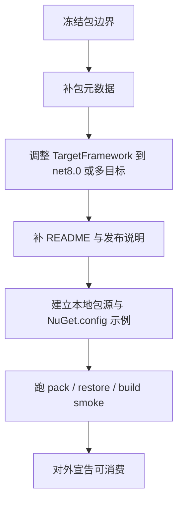

# AsterGraph NuGet 就绪清单

## 文档定位

本文档用于收口 `AsterGraph` 作为外部 NuGet 包被 `VibraVision.Integrated` 等宿主仓库消费前必须满足的前置条件。  
目标不是讨论节点图产品形态，而是明确包发布、目标框架、版本治理、README、验证命令和交付边界。

本文档覆盖：

- 当前 NuGet 可消费边界现状
- 必须满足的对外发布门槛
- 推荐的包拆分与依赖边界
- 版本/框架/包源策略
- 代码规范、注释规范、README 规范、下一阶段工作

本文档不直接覆盖：

- `AsterGraph` 产品功能扩展路线
- `VibraVision` 侧业务节点定义
- 外部宿主仓库的实现计划

## 当前状态

`AsterGraph` 当前已经具备较清晰的分层结构：

- `AsterGraph.Abstractions`
- `AsterGraph.Core`
- `AsterGraph.Editor`
- `AsterGraph.Avalonia`
- `AsterGraph.Demo`

同时，以下能力已经存在：

- 一对多 fan-out
- canvas / node / port / connection 四级上下文菜单
- 参数 Inspector
- 编辑器状态与 Avalonia 宿主分层

但目前仍不应视为“已完成正式 NuGet 发布准备”，因为：

- 缺少显式 NuGet 打包元数据
- 当前统一目标框架仍为 `net9.0`
- 尚未冻结版本策略、包源策略和 API 稳定性策略

## 推荐的对外包边界

建议后续正式对外暴露的包边界如下：

- `AsterGraph.Abstractions`
  - 稳定合同层
  - 适合第三方节点定义提供者直接引用

- `AsterGraph.Core`
  - 图模型、序列化、兼容规则
  - 适合宿主在需要显式模型映射时引用

- `AsterGraph.Editor`
  - 编辑器状态与菜单/命令/Inspector 绑定逻辑
  - 适合高级宿主扩展场景显式引用

- `AsterGraph.Avalonia`
  - Avalonia 控件入口
  - 作为大多数宿主的默认直接 UI 依赖

- `AsterGraph.Demo`
  - 不应作为对外消费包

## 宿主默认依赖建议

对于 `VibraVision.Integrated` 这类宿主，推荐默认依赖边界是：

- 直接依赖：
  - `AsterGraph.Avalonia`
  - `AsterGraph.Abstractions`

- 仅在需要时显式依赖：
  - `AsterGraph.Core`
  - `AsterGraph.Editor`

这样可以减少宿主对内部编辑器编排细节的耦合。

## 必须满足的发布门槛

### 1. 包元数据

每个正式对外包至少要补齐：

- `PackageId`
- `Version`
- `Authors`
- `Description`
- `RepositoryUrl`
- `PackageReadmeFile`
- `PackageTags`
- `IsPackable`

### 2. 目标框架

当前统一 `net9.0` 不适合直接给当前 `net8.0` 主线宿主使用。  
必须满足以下至少一项：

- 下探到 `net8.0`
- 或改成 `net8.0;net9.0` 多目标框架

### 3. 版本策略

必须冻结：

- 主版本策略
- 破坏性变更策略
- 预发布版本命名规则
- 包升级兼容承诺

### 4. 包源策略

必须明确：

- 本地包源路径
- CI 产物包源
- 正式发布包源
- `NuGet.config` 的最小示例

### 5. API 稳定性

建议至少补齐：

- XML 文档输出
- 公共 API 审核基线
- 最小包 smoke 测试
- SourceLink / symbols 策略

## 建议执行顺序

## 最小验证命令

在完成元数据与框架调整后，至少应能跑通：

- `dotnet build avalonia-node-map.sln`
- `dotnet pack src/AsterGraph.Abstractions/AsterGraph.Abstractions.csproj -c Release`
- `dotnet pack src/AsterGraph.Core/AsterGraph.Core.csproj -c Release`
- `dotnet pack src/AsterGraph.Editor/AsterGraph.Editor.csproj -c Release`
- `dotnet pack src/AsterGraph.Avalonia/AsterGraph.Avalonia.csproj -c Release`

若要验证外部消费，还应在一个干净宿主中完成：

- `dotnet restore`
- `dotnet build`
- Avalonia 宿主启动 smoke

## 与 VibraVision 节点图计划的关系

`VibraVision` 节点图计划中的 Task 3 及后续 AsterGraph 接入任务，应把本文档视为放行条件。  
只有当本文档中的关键门槛满足后，宿主仓库才应进入正式包接入阶段。

## 代码规范

- `AsterGraph` 内不应因为对外打包而打破现有分层边界。
- `AsterGraph.Abstractions` 必须继续保持最小依赖、稳定合同层定位。
- 不允许为了快速发包，把 Demo 类型或宿主特定逻辑塞回核心包。

## 注释规范

- 所有新增 public 类型、public 方法、public属性应继续补清晰 XML 注释。
- 与 NuGet/发布相关的注释应解释“为什么需要这项元数据或兼容策略”，而不是只写表面配置名。
- 若某个 API 仍处于易变阶段，注释和 README 都必须显式说明其稳定性预期。

## README 规范

- 根 README 必须说明：
  - 解决方案结构
  - 各包的定位
  - 推荐宿主依赖边界
  - Quick Start
  - 包消费示例
- 各库 README 必须与包元数据一致，不允许 README 和 `csproj` 对外口径冲突。
- README 必须包含中文主文案、`mermaid` 图和最小验证命令。

## 下一阶段工作

- 为四个正式包补齐打包元数据与版本治理策略。
- 将目标框架调整为可被 `net8.0` 宿主消费的方案。
- 增加一个最小外部宿主 smoke 工程，验证 NuGet 消费闭环。

